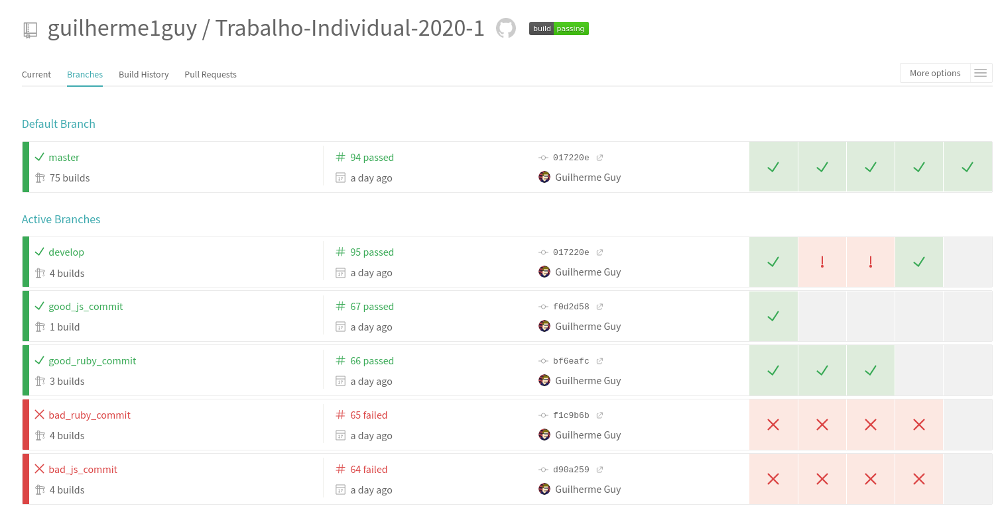
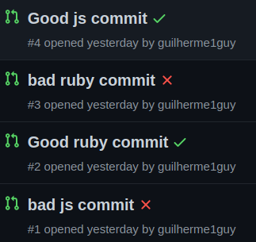
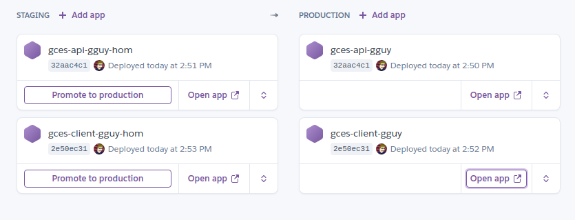
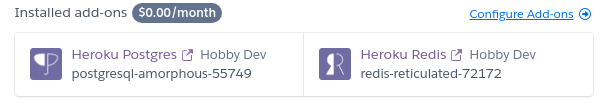

# Descrição do Solução

## 1. Containerização

Foi criada uma Dockerfile para cada projeto ([API](https://github.com/guilherme1guy/Trabalho-Individual-2020-1/blob/master/api/Dockerfile) e [Cliente](https://github.com/guilherme1guy/Trabalho-Individual-2020-1/blob/master/client/Dockerfile)) e configurado um [docker-compose](https://github.com/guilherme1guy/Trabalho-Individual-2020-1/blob/master/docker-compose.yml) para orquestrar a solução. O [docker-compose](https://github.com/guilherme1guy/Trabalho-Individual-2020-1/blob/master/docker-compose.yml) ao realizar as builds das imagens define o contexto para a pasta do subprojeto, para evitar que arquivos desnecessários entrem na build. A conteinerização foi pensada apenas para um ambiente de desenvolvimento, optei por utilizar os ambientes nativos na plataforma de CI e de Deploy.

No [docker-compose](https://github.com/guilherme1guy/Trabalho-Individual-2020-1/blob/master/docker-compose.yml) o serviço do PostgreSQL é provido. Seus dados são salvos em um volume nomeado, declarado no [docker-compose](https://github.com/guilherme1guy/Trabalho-Individual-2020-1/blob/master/docker-compose.yml). Dessa forma não é criada uma pasta pertencente ao root, ou outro usuário que seja usado no container, dentro da pasta do projeto.

Foi necessário alterar o arquivo de [database.yml](https://github.com/guilherme1guy/Trabalho-Individual-2020-1/blob/master/api/config/database.yml) para permitir definir o host do banco de dados a partir de uma variável de ambiente.

## 2. Integração Contínua

Para a integração contínua foi utilizado o [TravisCI](https://travis-ci.com/github/guilherme1guy/Trabalho-Individual-2020-1) para executar os passos de CI, o [Codecov](https://codecov.io/gh/guilherme1guy/Trabalho-Individual-2020-1/) para permitir a coleta de métricas de cobertura de código e o [CodeClimate](https://codeclimate.com/github/guilherme1guy/Trabalho-Individual-2020-1) para fornecer uma análise estática dos arquivos de código.

O [TravisCI](https://travis-ci.com/github/guilherme1guy/Trabalho-Individual-2020-1) foi configurado no arquivo [.travis.yml](https://github.com/guilherme1guy/Trabalho-Individual-2020-1/blob/master/.travis.yml) de forma que a build da API e do Client ocorram de forma concorrente e isolada. Um commit feito em qualquer branch passará pelo [TravisCI](https://travis-ci.com/github/guilherme1guy/Trabalho-Individual-2020-1), onde será feita a instalação dos requisitos do serviço e depois os testes unitários serão executados. No caso do Client um processo de *lint* também será executado, resultando em falha caso encontre algum erro.

Pull Requests também passam por verificação e só poderão ser mergeados na branch padrão (neste caso a *master*) caso todas as verificações sejam aprovadas. Para testar isso foram criados Pull Requests com alterações válidas e inválidas para cada projeto:

- [Bom commit - API](https://github.com/guilherme1guy/Trabalho-Individual-2020-1/pull/2)
- [Mau commit - API](https://github.com/guilherme1guy/Trabalho-Individual-2020-1/pull/3)
- [Bom commit - Client](https://github.com/guilherme1guy/Trabalho-Individual-2020-1/pull/4)
- [Mau commit - Client](https://github.com/guilherme1guy/Trabalho-Individual-2020-1/pull/1)

Métricas de cobertura de código são coletadas no [Codecov](https://codecov.io/gh/guilherme1guy/Trabalho-Individual-2020-1/). Ele foi escolhido por permitir que sejam reportados resultados parciais de cobertura para um commit. Dessa forma não é preciso sincronizar os resultados da build da API e do Client. Ele coleta resultados do repositório. Essas decisões foram tomadas para manter a arquitetura de mono repositório deste projeto.

Além disso, foi integrado o [CodeClimate](https://codeclimate.com/github/guilherme1guy/Trabalho-Individual-2020-1), inicialmente para coletar métricas de cobertura, mas isso foi alterado, já que ele não permite resultados parciais. Portanto ficou apenas integrado para prover a análise estática do código, detectando *code smells* no projeto.

## 3. Deploy Contínuo

Com o [TravisCI](https://travis-ci.com/github/guilherme1guy/Trabalho-Individual-2020-1) e o Heroku foi feito o deploy contínuo das aplicações em um ambiente de estável (branch *master*) e de homologação (branch *develop*). Cada commit em uma dessas branches irá, caso os testes sejam aprovados, submeter um novo *release* no Heroku. A API e o Client são executados em *dynos*, que são os servidores em contêineres do Heroku, diferentes dentro do Heroku e o ponto de chamada do Client para a API é definido por meio de uma variável de ambiente definida no *dyno*.

O deploy é iniciado no [TravisCI](https://travis-ci.com/github/guilherme1guy/Trabalho-Individual-2020-1) usando os scripts [init_heroku_deploy.sh](https://github.com/guilherme1guy/Trabalho-Individual-2020-1/blob/master/init_heroku_deploy.sh) e [heroku_deploy.sh](https://github.com/guilherme1guy/Trabalho-Individual-2020-1/blob/master/heroku_deploy.sh). Eles são usados para contornar a incompatibilidade do Heroku com projetos de mono repositório. Estes scripts separam a pasta da API ou do Client e enviam apenas ela para o Heroku, como se fosse a raíz do projeto.

Links para os Ambientes:
- [API Estável](https://gces-api-gguy.herokuapp.com/)
- [API Homologação](https://gces-api-gguy-hom.herokuapp.com/)
- [Client Estável](https://gces-client-gguy.herokuapp.com/)
- [Client Homologação](https://gces-client-gguy-hom.herokuapp.com/)

Para a API são provisionados o PostgreSQL e o Redis em produção por meio de *add-ons* no Heroku:

**Observações sobre o Heroku:**
- Estou utilizando os servidores gratuitos do Heroku, por isso eles dormem após um período de inatividade. Um problema que encontrei e não soube resolver, por causa da falta de familiaridade com o Vue, foi a demora para iniciar o Client. Ele dá *timeout* nas conexões por alguns minutos após o primeiro acesso, enquanto o *dyno* inicia. Imagino que ele esteja tentando compilar os arquivos estáticos sempre que inicia, mas eu não soube como resolver isso. Depois de uns minutos ele funciona normalmente.
- Os endereços de servidores da  API retornam um erro 404 como resposta quando acessados pelo navegador, pois o servidor do Ruby está funcionando no modo API, não retornando nenhuma página estática.
- Alterei o arquivo [database.yml](https://github.com/guilherme1guy/Trabalho-Individual-2020-1/blob/master/api/config/database.yml) para o ambiente de produção para usar a configuração recomendada para o Heroku.

